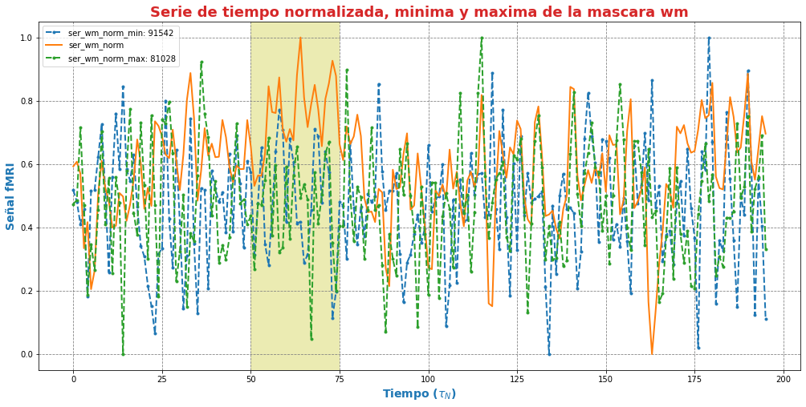

---
---

***Andres Eduardo Aracena Rangel***

*Estudiante del programa del Magister en Física Médica*

---
---


El siguiente Script de Python forma parte del trabajo especial de grado.

Profesora Guía:

*PhD María Daniela Cornejo*

---

---

&nbsp;
Con referencia:

- [Pagina oficial Nibabel](https://nipy.org/nibabel/index.html) 

Imagenes de fMRI extraidas de OpenNuero:
 
 - [ds002422](https://openneuro.org/datasets/ds002422/versions/1.1.0)
 
 ---
 Acronimos:

- CSF: Cerebrospinal Fluid (*líquido cefalorraquídeo*)
- GM: Gray Matter (*materia gris*)
- WM: White Matter (*materia blanca*)
---
NOTA:
Cuando indiquemos imagenes brain o mascaras brain, nos estamos refieriendo a las imagenes o mascaras de csf, wm, gm

# Promedio de las serie de tiempo de mascaras csf, gm y wm

Del notebook **03_extraccion_series_tiempo_brain_umbral_095.ipynb** se extrajo las series de tiempo que corresponden a las mascaras para csf, gm y wm para el umbral de *0.95*.

En este notebook solo trabajaremos con las mascaras de csf, gm y wm pafa el umbral de 0.95, donde extraeremos su serie de tiempo promedio y normalizada.

&nbsp;
## Importamos librerias


```python
import time # medir el tiempo de ejecución de nuestros programas
start = time.process_time()
inicio = time.time()
```


```python
import os # El módulo os nos permite acceder a funcionalidades dependientes del Sistema Operativo
from os.path import join as opj # Este método concatena varios componentes de ruta con exactamente un separador de directorio(‘/’)

from nipype import SelectFiles

import nibabel as nib
import numpy as np
import matplotlib.pyplot as plt

import pandas as pd

from nilearn.plotting import plot_anat
%matplotlib inline
```

    220720-15:29:56,936 nipype.utils WARNING:
    	 A newer version (1.8.3) of nipy/nipype is available. You are using 1.7.0


    /home/aracena/.local/lib/python3.9/site-packages/nilearn/datasets/__init__.py:93: FutureWarning: Fetchers from the nilearn.datasets module will be updated in version 0.9 to return python strings instead of bytes and Pandas dataframes instead of Numpy arrays.
      warn("Fetchers from the nilearn.datasets module will be "


## Definimos parámetros


```python
'''
Ruta del directorio de la data
'''
path_data = '/home/aracena/thesis_ds002422/' 

'''
Ruta donde reposa las series de tiempo (y posición de voxels) extraidas de las mascacaras csf, gm y wm
'''
path_ser = opj(path_data,'03_fase2_extraccion_series_tiempo_brain','output')

'''
lista de tejidos a procesar
'''
tejido = ['ser_mask_csf', 'ser_mask_gm', 'ser_mask_wm']

      
'''
Ingrese el umbral de la mascara que se realiza el promedio de sus series
(se extrajeron tres mask brain para tres umbrales distintos)
'''
umbral_sel = '0.95'

'''
Ruta donde se guardaran los resultados
'''
path_out = opj(path_data,'04_fase2_promedio_series_tiempo_brain','output', umbral_sel)

# Ruta donde se guardara archivos csv
path_csv = opj(path_out,'archivos_csv')

# Ruta donde se guardaran las imagenes png
path_png = opj(path_out,'archivos_png')

'''
Creamos la carpeta de salida
'''
os.system('mkdir -p %s'%path_out)
os.system('mkdir -p %s'%path_csv)
os.system('mkdir -p %s'%path_png)

'''
Creamos la carpeta de salida para tablas
'''
path_out_DF = opj(path_out,'tablas_proyecto')
os.system('mkdir -p %s'%path_out_DF);
```

## Definimos funciones

### Función para graficar series de tiempo


```python
'''
Función grafica las series de tiempo de una DF introducida. Se requiere input:

- df_data = Dataframe que contiene las series de tiempo
- name_save = nombre con que desea guardar el grafico
'''

def plot_series_time(df_data, resaltar, titulo, name_save): 
    # Creamos una lista con las claves del diccionario ingresado
    tejido = list(df_data.keys())
    # definimos una ventana
    vent_min = 50
    vent_max = 75


    font1 = {'fontsize':14, 'fontweight':'bold', 'color':'tab:blue'}
    font2  = {'fontsize':18, 'fontweight':'bold', 'color':'tab:red'}

    fig, ax = plt.subplots(figsize = (17,8))
    for i,tisue in enumerate(tejido):
        if resaltar == 'all':
            ax.plot(df_data[tisue], linewidth=2, label=tisue)
        else:
            if tisue == resaltar:
                ax.plot(df_data[tisue], linewidth=2, label=tisue)
            else:           
                ax.plot(df_data[tisue], '--.', linewidth=2, label=tisue)

    ax.legend()
    ax.set_xlabel('Tiempo ($\\tau_N$)',fontdict=font1)
    ax.set_ylabel('Señal fMRI',fontdict=font1)
    ax.set_title(titulo, fontdict = font2)
    ax.grid(axis = 'x', color = 'gray', linestyle = 'dashed')
    ax.grid(axis = 'y', color = 'gray', linestyle = 'dashed')
    ax.axvspan(vent_min,vent_max, alpha=0.3, facecolor='y')

    plt.savefig(opj(path_png, name_save))
```

## Cargamos datos de las series de tiempo de las mascaras brain

### Interfaz SelectFiles - ser_brain_mask

En esta oportunidad, trabajaremos con interface* SelectFiles*, para extraer las direcciones de las series de tiempo extraidas de las mascaras brain, y posteriormente cargamos sus datos en un diccionario.

Extramos las rutas de las series de tiempo de las mascaras para el umbralestablecido; extracion de series de tiempo en el notebook **03_extraccion_series_tiempo_brain_umbral_095.ipynb**


```python
# La entrada template indica la plantilla de cadena que debe coincidir en el directorio indicado a buscar
templates = {'ser_brain': '{umbral}/archivos_csv/serie_tiempo_all_mask_*.csv'}
       
selectfiles = SelectFiles(templates)


'''
Inputs
- Ubicación de la carpeta del conjunto de datos
- Cadenas de marcador de posición {}
'''
# La entrada base_directory indica en que directorio buscar
selectfiles.inputs.base_directory = path_ser

#Ingresamos la(s) cadena(s) de marcador de posición {} con valores
selectfiles.inputs.umbral = umbral_sel
#selectfiles.inputs.tejido = tejido
#ser_brain_mask.iterables = ('tejido', tejido)

# ejecutamos 
ser_brain_mask = selectfiles.run().outputs
```


```python
ser_brain_mask
```


    
    ser_brain = ['/home/aracena/thesis_ds002422/03_fase2_extraccion_series_tiempo_brain/output/0.95/archivos_csv/serie_tiempo_all_mask_csf.csv', '/home/aracena/thesis_ds002422/03_fase2_extraccion_series_tiempo_brain/output/0.95/archivos_csv/serie_tiempo_all_mask_gm.csv', '/home/aracena/thesis_ds002422/03_fase2_extraccion_series_tiempo_brain/output/0.95/archivos_csv/serie_tiempo_all_mask_wm.csv']


### Diccionarios para las series de tiempo de las mascaras brain


```python
ser_all_brain = dict(zip(tejido,ser_brain_mask.ser_brain))
print('series de tiempo de las mascaras\n', ser_all_brain)
```

    series de tiempo de las mascaras
     {'ser_mask_csf': '/home/aracena/thesis_ds002422/03_fase2_extraccion_series_tiempo_brain/output/0.95/archivos_csv/serie_tiempo_all_mask_csf.csv', 'ser_mask_gm': '/home/aracena/thesis_ds002422/03_fase2_extraccion_series_tiempo_brain/output/0.95/archivos_csv/serie_tiempo_all_mask_gm.csv', 'ser_mask_wm': '/home/aracena/thesis_ds002422/03_fase2_extraccion_series_tiempo_brain/output/0.95/archivos_csv/serie_tiempo_all_mask_wm.csv'}


### Cargamos los datos de las series de tiempo


```python
#lista_brain = list(mask.keys()) # extraemos una lista de las mascaras

ser_tiem = {}
for i, tisue in enumerate(ser_all_brain):
    ser_tiem[tisue] = pd.read_csv(ser_all_brain[tisue])

print(ser_tiem['ser_mask_csf'].shape)
print(ser_tiem['ser_mask_wm'].shape)
print(ser_tiem['ser_mask_gm'].shape)
```

    (196, 664)
    (196, 9439)
    (196, 1794)


```python
pd.options.display.max_columns = 8
ser_tiem['ser_mask_csf']
```


<div>
<style scoped>
    .dataframe tbody tr th:only-of-type {
        vertical-align: middle;
    }

    .dataframe tbody tr th {
        vertical-align: top;
    }

    .dataframe thead th {
        text-align: right;
    }
</style>
<table border="1" class="dataframe">
  <thead>
    <tr style="text-align: right;">
      <th></th>
      <th>42789</th>
      <th>42790</th>
      <th>42791</th>
      <th>42833</th>
      <th>...</th>
      <th>119220</th>
      <th>119224</th>
      <th>119225</th>
      <th>119226</th>
    </tr>
  </thead>
  <tbody>
    <tr>
      <th>0</th>
      <td>147.668701</td>
      <td>199.851395</td>
      <td>321.464417</td>
      <td>319.859619</td>
      <td>...</td>
      <td>563.222595</td>
      <td>571.135742</td>
      <td>569.495667</td>
      <td>573.659790</td>
    </tr>
    <tr>
      <th>1</th>
      <td>147.734985</td>
      <td>203.295837</td>
      <td>316.090210</td>
      <td>320.602753</td>
      <td>...</td>
      <td>572.265747</td>
      <td>574.809692</td>
      <td>565.620789</td>
      <td>569.487976</td>
    </tr>
    <tr>
      <th>2</th>
      <td>147.813690</td>
      <td>198.290558</td>
      <td>318.719666</td>
      <td>324.457642</td>
      <td>...</td>
      <td>579.156067</td>
      <td>568.527588</td>
      <td>569.592651</td>
      <td>570.382019</td>
    </tr>
    <tr>
      <th>3</th>
      <td>148.630875</td>
      <td>207.636703</td>
      <td>311.952423</td>
      <td>325.447235</td>
      <td>...</td>
      <td>562.293640</td>
      <td>570.185669</td>
      <td>564.723206</td>
      <td>571.315186</td>
    </tr>
    <tr>
      <th>4</th>
      <td>148.653290</td>
      <td>203.587326</td>
      <td>304.501617</td>
      <td>329.378143</td>
      <td>...</td>
      <td>564.004456</td>
      <td>575.846069</td>
      <td>566.695435</td>
      <td>577.148010</td>
    </tr>
    <tr>
      <th>...</th>
      <td>...</td>
      <td>...</td>
      <td>...</td>
      <td>...</td>
      <td>...</td>
      <td>...</td>
      <td>...</td>
      <td>...</td>
      <td>...</td>
    </tr>
    <tr>
      <th>191</th>
      <td>141.190781</td>
      <td>206.106812</td>
      <td>308.748840</td>
      <td>318.514404</td>
      <td>...</td>
      <td>570.030457</td>
      <td>570.975403</td>
      <td>568.758972</td>
      <td>574.168945</td>
    </tr>
    <tr>
      <th>192</th>
      <td>148.696869</td>
      <td>212.194748</td>
      <td>314.824097</td>
      <td>325.573364</td>
      <td>...</td>
      <td>576.565796</td>
      <td>573.521729</td>
      <td>570.436768</td>
      <td>570.730591</td>
    </tr>
    <tr>
      <th>193</th>
      <td>152.130447</td>
      <td>211.498489</td>
      <td>313.927216</td>
      <td>315.044403</td>
      <td>...</td>
      <td>569.587463</td>
      <td>565.593323</td>
      <td>567.328613</td>
      <td>574.088501</td>
    </tr>
    <tr>
      <th>194</th>
      <td>146.669983</td>
      <td>214.301300</td>
      <td>301.381012</td>
      <td>306.016785</td>
      <td>...</td>
      <td>573.925476</td>
      <td>576.993652</td>
      <td>574.053040</td>
      <td>576.496826</td>
    </tr>
    <tr>
      <th>195</th>
      <td>140.227005</td>
      <td>208.586624</td>
      <td>303.595093</td>
      <td>295.467163</td>
      <td>...</td>
      <td>568.996338</td>
      <td>571.335266</td>
      <td>571.035278</td>
      <td>575.821350</td>
    </tr>
  </tbody>
</table>
<p>196 rows × 664 columns</p>
</div>


```python
ser_tiem['ser_mask_csf']['42789'].describe()
```


    count    196.000000
    mean     143.845704
    std        6.412026
    min      124.052040
    25%      140.418392
    50%      144.187172
    75%      147.754662
    max      160.470428
    Name: 42789, dtype: float64


```python
ser_tiem['ser_mask_csf']['119226'].describe()
```


    count    196.000000
    mean     572.781509
    std        2.955697
    min      564.041931
    25%      570.722473
    50%      572.566437
    75%      574.722824
    max      580.456299
    Name: 119226, dtype: float64


## Cargamos datos del promedio de las series de tiempo de las mascaras brain

### Interfaz SelectFiles - ser_norm_brain_mask

En esta oportunidad, trabajaremos con interface* SelectFiles*, para extraer las direcciones del promedio de las series de tiempo extraidas de las mascaras brain, y posteriormente cargamos sus datos en un diccionario.

Extramos las rutas de las series de tiempo de las mascaras para el umbralestablecido; extracion de series de tiempo en el notebook **03_extraccion_series_tiempo_brain_umbral_095.ipynb**


```python
# La entrada template indica la plantilla de cadena que debe coincidir en el directorio indicado a buscar
templates = {'ser_norm_brain': '{umbral}/archivos_csv/serie_tiempo_all_norm_mask_*.csv'}
       
selectfiles = SelectFiles(templates)


'''
Inputs
- Ubicación de la carpeta del conjunto de datos
- Cadenas de marcador de posición {}
'''
# La entrada base_directory indica en que directorio buscar
selectfiles.inputs.base_directory = path_ser

#Ingresamos la(s) cadena(s) de marcador de posición {} con valores
selectfiles.inputs.umbral = umbral_sel
#selectfiles.inputs.tejido = tejido
#ser_brain_mask.iterables = ('tejido', tejido)

# ejecutamos 
ser_norm_brain_mask = selectfiles.run().outputs
```


```python
ser_norm_brain_mask
```


    
    ser_norm_brain = ['/home/aracena/thesis_ds002422/03_fase2_extraccion_series_tiempo_brain/output/0.95/archivos_csv/serie_tiempo_all_norm_mask_csf.csv', '/home/aracena/thesis_ds002422/03_fase2_extraccion_series_tiempo_brain/output/0.95/archivos_csv/serie_tiempo_all_norm_mask_gm.csv', '/home/aracena/thesis_ds002422/03_fase2_extraccion_series_tiempo_brain/output/0.95/archivos_csv/serie_tiempo_all_norm_mask_wm.csv']


### Diccionarios para el promedio de las series de tiempo de las mascaras brain


```python
ser_norm_all_brain = dict(zip(tejido,ser_norm_brain_mask.ser_norm_brain))
print('series de tiempo normalizadas de las mascaras\n', ser_norm_all_brain)
```

    series de tiempo normalizadas de las mascaras
     {'ser_mask_csf': '/home/aracena/thesis_ds002422/03_fase2_extraccion_series_tiempo_brain/output/0.95/archivos_csv/serie_tiempo_all_norm_mask_csf.csv', 'ser_mask_gm': '/home/aracena/thesis_ds002422/03_fase2_extraccion_series_tiempo_brain/output/0.95/archivos_csv/serie_tiempo_all_norm_mask_gm.csv', 'ser_mask_wm': '/home/aracena/thesis_ds002422/03_fase2_extraccion_series_tiempo_brain/output/0.95/archivos_csv/serie_tiempo_all_norm_mask_wm.csv'}


### Cargamos los datos del promedio de las series de tiempo


```python
#lista_brain = list(mask.keys()) # extraemos una lista de las mascaras

ser_tiem_norm = {}
for i, tisue in enumerate(ser_norm_all_brain):
    ser_tiem_norm[tisue] = pd.read_csv(ser_norm_all_brain[tisue])
```


```python
pd.options.display.max_columns = 8
ser_tiem_norm['ser_mask_csf']
```


<div>
<style scoped>
    .dataframe tbody tr th:only-of-type {
        vertical-align: middle;
    }

    .dataframe tbody tr th {
        vertical-align: top;
    }

    .dataframe thead th {
        text-align: right;
    }
</style>
<table border="1" class="dataframe">
  <thead>
    <tr style="text-align: right;">
      <th></th>
      <th>42789</th>
      <th>42790</th>
      <th>42791</th>
      <th>42833</th>
      <th>...</th>
      <th>119220</th>
      <th>119224</th>
      <th>119225</th>
      <th>119226</th>
    </tr>
  </thead>
  <tbody>
    <tr>
      <th>0</th>
      <td>0.648482</td>
      <td>0.465610</td>
      <td>0.696788</td>
      <td>0.561077</td>
      <td>...</td>
      <td>0.326825</td>
      <td>0.561927</td>
      <td>0.516017</td>
      <td>0.585941</td>
    </tr>
    <tr>
      <th>1</th>
      <td>0.650302</td>
      <td>0.557280</td>
      <td>0.593478</td>
      <td>0.577106</td>
      <td>...</td>
      <td>0.668015</td>
      <td>0.744916</td>
      <td>0.311767</td>
      <td>0.331785</td>
    </tr>
    <tr>
      <th>2</th>
      <td>0.652463</td>
      <td>0.424070</td>
      <td>0.644025</td>
      <td>0.660252</td>
      <td>...</td>
      <td>0.927980</td>
      <td>0.432023</td>
      <td>0.521129</td>
      <td>0.386252</td>
    </tr>
    <tr>
      <th>3</th>
      <td>0.674902</td>
      <td>0.672808</td>
      <td>0.513937</td>
      <td>0.681597</td>
      <td>...</td>
      <td>0.291776</td>
      <td>0.514607</td>
      <td>0.264454</td>
      <td>0.443103</td>
    </tr>
    <tr>
      <th>4</th>
      <td>0.675517</td>
      <td>0.565038</td>
      <td>0.370708</td>
      <td>0.766383</td>
      <td>...</td>
      <td>0.356324</td>
      <td>0.796534</td>
      <td>0.368413</td>
      <td>0.798452</td>
    </tr>
    <tr>
      <th>...</th>
      <td>...</td>
      <td>...</td>
      <td>...</td>
      <td>...</td>
      <td>...</td>
      <td>...</td>
      <td>...</td>
      <td>...</td>
      <td>...</td>
    </tr>
    <tr>
      <th>191</th>
      <td>0.470607</td>
      <td>0.632092</td>
      <td>0.452353</td>
      <td>0.532062</td>
      <td>...</td>
      <td>0.583679</td>
      <td>0.553941</td>
      <td>0.477185</td>
      <td>0.616960</td>
    </tr>
    <tr>
      <th>192</th>
      <td>0.676714</td>
      <td>0.794115</td>
      <td>0.569139</td>
      <td>0.684318</td>
      <td>...</td>
      <td>0.830251</td>
      <td>0.680766</td>
      <td>0.565624</td>
      <td>0.407488</td>
    </tr>
    <tr>
      <th>193</th>
      <td>0.770995</td>
      <td>0.775585</td>
      <td>0.551899</td>
      <td>0.457217</td>
      <td>...</td>
      <td>0.566965</td>
      <td>0.285876</td>
      <td>0.401789</td>
      <td>0.612060</td>
    </tr>
    <tr>
      <th>194</th>
      <td>0.621058</td>
      <td>0.850179</td>
      <td>0.310720</td>
      <td>0.262500</td>
      <td>...</td>
      <td>0.730635</td>
      <td>0.853692</td>
      <td>0.756242</td>
      <td>0.758780</td>
    </tr>
    <tr>
      <th>195</th>
      <td>0.444143</td>
      <td>0.698089</td>
      <td>0.353282</td>
      <td>0.034954</td>
      <td>...</td>
      <td>0.544663</td>
      <td>0.571865</td>
      <td>0.597172</td>
      <td>0.717629</td>
    </tr>
  </tbody>
</table>
<p>196 rows × 664 columns</p>
</div>


## Promediamos las series de tiempo de cada mascara

### Estrategia

Aplicamos la transpuesta del dataframe que contiene las series de tiempo de la mascara que deseamos promediar, asi de esta manera, tendremos en las columnas la variable **tiempo** y aplicamos el método de pandas *mean()* para calcular el promedio de una columna del dataframe. DE esta manera obtenemos la seria promedio de las mascaras brain


```python
ser_tiem['ser_mask_csf']
```


<div>
<style scoped>
    .dataframe tbody tr th:only-of-type {
        vertical-align: middle;
    }

    .dataframe tbody tr th {
        vertical-align: top;
    }

    .dataframe thead th {
        text-align: right;
    }
</style>
<table border="1" class="dataframe">
  <thead>
    <tr style="text-align: right;">
      <th></th>
      <th>42789</th>
      <th>42790</th>
      <th>42791</th>
      <th>42833</th>
      <th>...</th>
      <th>119220</th>
      <th>119224</th>
      <th>119225</th>
      <th>119226</th>
    </tr>
  </thead>
  <tbody>
    <tr>
      <th>0</th>
      <td>147.668701</td>
      <td>199.851395</td>
      <td>321.464417</td>
      <td>319.859619</td>
      <td>...</td>
      <td>563.222595</td>
      <td>571.135742</td>
      <td>569.495667</td>
      <td>573.659790</td>
    </tr>
    <tr>
      <th>1</th>
      <td>147.734985</td>
      <td>203.295837</td>
      <td>316.090210</td>
      <td>320.602753</td>
      <td>...</td>
      <td>572.265747</td>
      <td>574.809692</td>
      <td>565.620789</td>
      <td>569.487976</td>
    </tr>
    <tr>
      <th>2</th>
      <td>147.813690</td>
      <td>198.290558</td>
      <td>318.719666</td>
      <td>324.457642</td>
      <td>...</td>
      <td>579.156067</td>
      <td>568.527588</td>
      <td>569.592651</td>
      <td>570.382019</td>
    </tr>
    <tr>
      <th>3</th>
      <td>148.630875</td>
      <td>207.636703</td>
      <td>311.952423</td>
      <td>325.447235</td>
      <td>...</td>
      <td>562.293640</td>
      <td>570.185669</td>
      <td>564.723206</td>
      <td>571.315186</td>
    </tr>
    <tr>
      <th>4</th>
      <td>148.653290</td>
      <td>203.587326</td>
      <td>304.501617</td>
      <td>329.378143</td>
      <td>...</td>
      <td>564.004456</td>
      <td>575.846069</td>
      <td>566.695435</td>
      <td>577.148010</td>
    </tr>
    <tr>
      <th>...</th>
      <td>...</td>
      <td>...</td>
      <td>...</td>
      <td>...</td>
      <td>...</td>
      <td>...</td>
      <td>...</td>
      <td>...</td>
      <td>...</td>
    </tr>
    <tr>
      <th>191</th>
      <td>141.190781</td>
      <td>206.106812</td>
      <td>308.748840</td>
      <td>318.514404</td>
      <td>...</td>
      <td>570.030457</td>
      <td>570.975403</td>
      <td>568.758972</td>
      <td>574.168945</td>
    </tr>
    <tr>
      <th>192</th>
      <td>148.696869</td>
      <td>212.194748</td>
      <td>314.824097</td>
      <td>325.573364</td>
      <td>...</td>
      <td>576.565796</td>
      <td>573.521729</td>
      <td>570.436768</td>
      <td>570.730591</td>
    </tr>
    <tr>
      <th>193</th>
      <td>152.130447</td>
      <td>211.498489</td>
      <td>313.927216</td>
      <td>315.044403</td>
      <td>...</td>
      <td>569.587463</td>
      <td>565.593323</td>
      <td>567.328613</td>
      <td>574.088501</td>
    </tr>
    <tr>
      <th>194</th>
      <td>146.669983</td>
      <td>214.301300</td>
      <td>301.381012</td>
      <td>306.016785</td>
      <td>...</td>
      <td>573.925476</td>
      <td>576.993652</td>
      <td>574.053040</td>
      <td>576.496826</td>
    </tr>
    <tr>
      <th>195</th>
      <td>140.227005</td>
      <td>208.586624</td>
      <td>303.595093</td>
      <td>295.467163</td>
      <td>...</td>
      <td>568.996338</td>
      <td>571.335266</td>
      <td>571.035278</td>
      <td>575.821350</td>
    </tr>
  </tbody>
</table>
<p>196 rows × 664 columns</p>
</div>


```python
ser_tiem['ser_mask_csf'].T
```


<div>
<style scoped>
    .dataframe tbody tr th:only-of-type {
        vertical-align: middle;
    }

    .dataframe tbody tr th {
        vertical-align: top;
    }

    .dataframe thead th {
        text-align: right;
    }
</style>
<table border="1" class="dataframe">
  <thead>
    <tr style="text-align: right;">
      <th></th>
      <th>0</th>
      <th>1</th>
      <th>2</th>
      <th>3</th>
      <th>...</th>
      <th>192</th>
      <th>193</th>
      <th>194</th>
      <th>195</th>
    </tr>
  </thead>
  <tbody>
    <tr>
      <th>42789</th>
      <td>147.668701</td>
      <td>147.734985</td>
      <td>147.813690</td>
      <td>148.630875</td>
      <td>...</td>
      <td>148.696869</td>
      <td>152.130447</td>
      <td>146.669983</td>
      <td>140.227005</td>
    </tr>
    <tr>
      <th>42790</th>
      <td>199.851395</td>
      <td>203.295837</td>
      <td>198.290558</td>
      <td>207.636703</td>
      <td>...</td>
      <td>212.194748</td>
      <td>211.498489</td>
      <td>214.301300</td>
      <td>208.586624</td>
    </tr>
    <tr>
      <th>42791</th>
      <td>321.464417</td>
      <td>316.090210</td>
      <td>318.719666</td>
      <td>311.952423</td>
      <td>...</td>
      <td>314.824097</td>
      <td>313.927216</td>
      <td>301.381012</td>
      <td>303.595093</td>
    </tr>
    <tr>
      <th>42833</th>
      <td>319.859619</td>
      <td>320.602753</td>
      <td>324.457642</td>
      <td>325.447235</td>
      <td>...</td>
      <td>325.573364</td>
      <td>315.044403</td>
      <td>306.016785</td>
      <td>295.467163</td>
    </tr>
    <tr>
      <th>42834</th>
      <td>390.075043</td>
      <td>394.869293</td>
      <td>391.678802</td>
      <td>387.747406</td>
      <td>...</td>
      <td>412.295959</td>
      <td>415.206024</td>
      <td>417.359467</td>
      <td>411.607483</td>
    </tr>
    <tr>
      <th>...</th>
      <td>...</td>
      <td>...</td>
      <td>...</td>
      <td>...</td>
      <td>...</td>
      <td>...</td>
      <td>...</td>
      <td>...</td>
      <td>...</td>
    </tr>
    <tr>
      <th>119219</th>
      <td>564.928162</td>
      <td>574.859253</td>
      <td>582.090027</td>
      <td>564.800537</td>
      <td>...</td>
      <td>570.799500</td>
      <td>576.852112</td>
      <td>570.077942</td>
      <td>574.971375</td>
    </tr>
    <tr>
      <th>119220</th>
      <td>563.222595</td>
      <td>572.265747</td>
      <td>579.156067</td>
      <td>562.293640</td>
      <td>...</td>
      <td>576.565796</td>
      <td>569.587463</td>
      <td>573.925476</td>
      <td>568.996338</td>
    </tr>
    <tr>
      <th>119224</th>
      <td>571.135742</td>
      <td>574.809692</td>
      <td>568.527588</td>
      <td>570.185669</td>
      <td>...</td>
      <td>573.521729</td>
      <td>565.593323</td>
      <td>576.993652</td>
      <td>571.335266</td>
    </tr>
    <tr>
      <th>119225</th>
      <td>569.495667</td>
      <td>565.620789</td>
      <td>569.592651</td>
      <td>564.723206</td>
      <td>...</td>
      <td>570.436768</td>
      <td>567.328613</td>
      <td>574.053040</td>
      <td>571.035278</td>
    </tr>
    <tr>
      <th>119226</th>
      <td>573.659790</td>
      <td>569.487976</td>
      <td>570.382019</td>
      <td>571.315186</td>
      <td>...</td>
      <td>570.730591</td>
      <td>574.088501</td>
      <td>576.496826</td>
      <td>575.821350</td>
    </tr>
  </tbody>
</table>
<p>664 rows × 196 columns</p>
</div>


```python
ser_tiem['ser_mask_csf'].T.mean()
```


    0      608.445532
    1      607.909773
    2      608.436558
    3      606.512312
    4      607.254498
              ...    
    191    608.981452
    192    609.086091
    193    608.484934
    194    608.888241
    195    608.049152
    Length: 196, dtype: float64


### Damos un formato a las DF solo para ser extraidas a un documento


```python
df_1 = ser_tiem['ser_mask_csf'].copy()
df_1 = df_1.T
df_1

nomb_colum = df_1.columns.values
a = df_1.index

header = pd.MultiIndex.from_product([['tiempo ($\\tau_N$)'], nomb_colum],
                                    names=[' ','Series de tiempo: '+ 'ser_mask_csf'])
df_1 = pd.DataFrame(df_1.values, columns=header, index = a)

display(df_1.round(3))
```


<div>
<style scoped>
    .dataframe tbody tr th:only-of-type {
        vertical-align: middle;
    }

    .dataframe tbody tr th {
        vertical-align: top;
    }

    .dataframe thead tr th {
        text-align: left;
    }
</style>
<table border="1" class="dataframe">
  <thead>
    <tr>
      <th></th>
      <th colspan="9" halign="left">tiempo ($\tau_N$)</th>
    </tr>
    <tr>
      <th>Series de tiempo: ser_mask_csf</th>
      <th>0</th>
      <th>1</th>
      <th>2</th>
      <th>3</th>
      <th>...</th>
      <th>192</th>
      <th>193</th>
      <th>194</th>
      <th>195</th>
    </tr>
  </thead>
  <tbody>
    <tr>
      <th>42789</th>
      <td>147.669</td>
      <td>147.735</td>
      <td>147.814</td>
      <td>148.631</td>
      <td>...</td>
      <td>148.697</td>
      <td>152.130</td>
      <td>146.670</td>
      <td>140.227</td>
    </tr>
    <tr>
      <th>42790</th>
      <td>199.851</td>
      <td>203.296</td>
      <td>198.291</td>
      <td>207.637</td>
      <td>...</td>
      <td>212.195</td>
      <td>211.498</td>
      <td>214.301</td>
      <td>208.587</td>
    </tr>
    <tr>
      <th>42791</th>
      <td>321.464</td>
      <td>316.090</td>
      <td>318.720</td>
      <td>311.952</td>
      <td>...</td>
      <td>314.824</td>
      <td>313.927</td>
      <td>301.381</td>
      <td>303.595</td>
    </tr>
    <tr>
      <th>42833</th>
      <td>319.860</td>
      <td>320.603</td>
      <td>324.458</td>
      <td>325.447</td>
      <td>...</td>
      <td>325.573</td>
      <td>315.044</td>
      <td>306.017</td>
      <td>295.467</td>
    </tr>
    <tr>
      <th>42834</th>
      <td>390.075</td>
      <td>394.869</td>
      <td>391.679</td>
      <td>387.747</td>
      <td>...</td>
      <td>412.296</td>
      <td>415.206</td>
      <td>417.359</td>
      <td>411.607</td>
    </tr>
    <tr>
      <th>...</th>
      <td>...</td>
      <td>...</td>
      <td>...</td>
      <td>...</td>
      <td>...</td>
      <td>...</td>
      <td>...</td>
      <td>...</td>
      <td>...</td>
    </tr>
    <tr>
      <th>119219</th>
      <td>564.928</td>
      <td>574.859</td>
      <td>582.090</td>
      <td>564.801</td>
      <td>...</td>
      <td>570.799</td>
      <td>576.852</td>
      <td>570.078</td>
      <td>574.971</td>
    </tr>
    <tr>
      <th>119220</th>
      <td>563.223</td>
      <td>572.266</td>
      <td>579.156</td>
      <td>562.294</td>
      <td>...</td>
      <td>576.566</td>
      <td>569.587</td>
      <td>573.925</td>
      <td>568.996</td>
    </tr>
    <tr>
      <th>119224</th>
      <td>571.136</td>
      <td>574.810</td>
      <td>568.528</td>
      <td>570.186</td>
      <td>...</td>
      <td>573.522</td>
      <td>565.593</td>
      <td>576.994</td>
      <td>571.335</td>
    </tr>
    <tr>
      <th>119225</th>
      <td>569.496</td>
      <td>565.621</td>
      <td>569.593</td>
      <td>564.723</td>
      <td>...</td>
      <td>570.437</td>
      <td>567.329</td>
      <td>574.053</td>
      <td>571.035</td>
    </tr>
    <tr>
      <th>119226</th>
      <td>573.660</td>
      <td>569.488</td>
      <td>570.382</td>
      <td>571.315</td>
      <td>...</td>
      <td>570.731</td>
      <td>574.089</td>
      <td>576.497</td>
      <td>575.821</td>
    </tr>
  </tbody>
</table>
<p>664 rows × 196 columns</p>
</div>


### Promedio de las series de tiempo de las mascaras y posterior normalización


```python
df_brain_val_prom = pd.DataFrame()
df_brain_val_norm_pr = pd.DataFrame()
df_brain_norm_prom = pd.DataFrame()
for i,tisue in enumerate(tejido):   
    '''
    DF de valores promedios de voxel_val y voxel_norm
    '''

    df_brain_val_prom[tisue]=pd.DataFrame(ser_tiem[tisue].T.mean())
    df_brain_val_prom[tisue].columns = [tisue]

    df_brain_val_norm_pr[tisue]=pd.DataFrame(ser_tiem_norm[tisue].T.mean())
    df_brain_val_norm_pr[tisue].columns = [tisue]
    
    '''
    Volvemos a normalizar entre 0 y 1 a df_brain_norm_prom
    '''
    mini = df_brain_val_norm_pr[tisue].min()
    maxi = df_brain_val_norm_pr[tisue].max()
    df_brain_norm_prom[tisue] = (df_brain_val_norm_pr[tisue] - mini)/(maxi-mini)

lista_normalizacion = ['ser_csf_norm', 'ser_gm_norm', 'ser_wm_norm']
df_brain_norm_prom.columns = lista_normalizacion
```


```python
df_brain_val_prom.round(3)
```


<div>
<style scoped>
    .dataframe tbody tr th:only-of-type {
        vertical-align: middle;
    }

    .dataframe tbody tr th {
        vertical-align: top;
    }

    .dataframe thead th {
        text-align: right;
    }
</style>
<table border="1" class="dataframe">
  <thead>
    <tr style="text-align: right;">
      <th></th>
      <th>ser_mask_csf</th>
      <th>ser_mask_gm</th>
      <th>ser_mask_wm</th>
    </tr>
  </thead>
  <tbody>
    <tr>
      <th>0</th>
      <td>608.446</td>
      <td>544.591</td>
      <td>545.955</td>
    </tr>
    <tr>
      <th>1</th>
      <td>607.910</td>
      <td>544.170</td>
      <td>545.948</td>
    </tr>
    <tr>
      <th>2</th>
      <td>608.437</td>
      <td>543.839</td>
      <td>545.871</td>
    </tr>
    <tr>
      <th>3</th>
      <td>606.512</td>
      <td>543.127</td>
      <td>545.200</td>
    </tr>
    <tr>
      <th>4</th>
      <td>607.254</td>
      <td>543.957</td>
      <td>545.471</td>
    </tr>
    <tr>
      <th>...</th>
      <td>...</td>
      <td>...</td>
      <td>...</td>
    </tr>
    <tr>
      <th>191</th>
      <td>608.981</td>
      <td>544.611</td>
      <td>545.935</td>
    </tr>
    <tr>
      <th>192</th>
      <td>609.086</td>
      <td>543.623</td>
      <td>545.773</td>
    </tr>
    <tr>
      <th>193</th>
      <td>608.485</td>
      <td>543.943</td>
      <td>545.999</td>
    </tr>
    <tr>
      <th>194</th>
      <td>608.888</td>
      <td>544.576</td>
      <td>546.369</td>
    </tr>
    <tr>
      <th>195</th>
      <td>608.049</td>
      <td>544.453</td>
      <td>546.134</td>
    </tr>
  </tbody>
</table>
<p>196 rows × 3 columns</p>
</div>


```python
df_brain_norm_prom.round(3)
```


<div>
<style scoped>
    .dataframe tbody tr th:only-of-type {
        vertical-align: middle;
    }

    .dataframe tbody tr th {
        vertical-align: top;
    }

    .dataframe thead th {
        text-align: right;
    }
</style>
<table border="1" class="dataframe">
  <thead>
    <tr style="text-align: right;">
      <th></th>
      <th>ser_csf_norm</th>
      <th>ser_gm_norm</th>
      <th>ser_wm_norm</th>
    </tr>
  </thead>
  <tbody>
    <tr>
      <th>0</th>
      <td>0.659</td>
      <td>0.691</td>
      <td>0.593</td>
    </tr>
    <tr>
      <th>1</th>
      <td>0.606</td>
      <td>0.594</td>
      <td>0.608</td>
    </tr>
    <tr>
      <th>2</th>
      <td>0.676</td>
      <td>0.560</td>
      <td>0.569</td>
    </tr>
    <tr>
      <th>3</th>
      <td>0.413</td>
      <td>0.408</td>
      <td>0.334</td>
    </tr>
    <tr>
      <th>4</th>
      <td>0.499</td>
      <td>0.591</td>
      <td>0.417</td>
    </tr>
    <tr>
      <th>...</th>
      <td>...</td>
      <td>...</td>
      <td>...</td>
    </tr>
    <tr>
      <th>191</th>
      <td>0.718</td>
      <td>0.687</td>
      <td>0.608</td>
    </tr>
    <tr>
      <th>192</th>
      <td>0.720</td>
      <td>0.512</td>
      <td>0.551</td>
    </tr>
    <tr>
      <th>193</th>
      <td>0.633</td>
      <td>0.561</td>
      <td>0.651</td>
    </tr>
    <tr>
      <th>194</th>
      <td>0.731</td>
      <td>0.673</td>
      <td>0.751</td>
    </tr>
    <tr>
      <th>195</th>
      <td>0.626</td>
      <td>0.672</td>
      <td>0.696</td>
    </tr>
  </tbody>
</table>
<p>196 rows × 3 columns</p>
</div>


### Damos un formato a las DF solo para ser extraidas a un documento


```python
df_1 = df_brain_val_prom['ser_mask_csf'].copy()
df_1 = pd.DataFrame(df_1)

nomb_colum = df_1.columns.values

header = pd.MultiIndex.from_product([[' '], nomb_colum],
                                    names=[' ','tiempo'])
df_1 = pd.DataFrame(df_1.values, columns=header)

df_1.round(3)
```


<div>
<style scoped>
    .dataframe tbody tr th:only-of-type {
        vertical-align: middle;
    }

    .dataframe tbody tr th {
        vertical-align: top;
    }

    .dataframe thead tr th {
        text-align: left;
    }
</style>
<table border="1" class="dataframe">
  <thead>
    <tr>
      <th></th>
      <th></th>
    </tr>
    <tr>
      <th>tiempo</th>
      <th>ser_mask_csf</th>
    </tr>
  </thead>
  <tbody>
    <tr>
      <th>0</th>
      <td>608.446</td>
    </tr>
    <tr>
      <th>1</th>
      <td>607.910</td>
    </tr>
    <tr>
      <th>2</th>
      <td>608.437</td>
    </tr>
    <tr>
      <th>3</th>
      <td>606.512</td>
    </tr>
    <tr>
      <th>4</th>
      <td>607.254</td>
    </tr>
    <tr>
      <th>...</th>
      <td>...</td>
    </tr>
    <tr>
      <th>191</th>
      <td>608.981</td>
    </tr>
    <tr>
      <th>192</th>
      <td>609.086</td>
    </tr>
    <tr>
      <th>193</th>
      <td>608.485</td>
    </tr>
    <tr>
      <th>194</th>
      <td>608.888</td>
    </tr>
    <tr>
      <th>195</th>
      <td>608.049</td>
    </tr>
  </tbody>
</table>
<p>196 rows × 1 columns</p>
</div>


```python

df_1 = df_brain_val_prom.copy()

new_index = df_1.index+1

nomb_colum = df_1.columns.values

header = pd.MultiIndex.from_product([['Series de tiempo: '], nomb_colum],
                                    names=[' ','tiempo ($\\tau_N$)'])
df_1 = pd.DataFrame(df_1.values, columns=header, index=new_index)

display(df_1.round(3))
```


<div>
<style scoped>
    .dataframe tbody tr th:only-of-type {
        vertical-align: middle;
    }

    .dataframe tbody tr th {
        vertical-align: top;
    }

    .dataframe thead tr th {
        text-align: left;
    }
</style>
<table border="1" class="dataframe">
  <thead>
    <tr>
      <th></th>
      <th colspan="3" halign="left">Series de tiempo:</th>
    </tr>
    <tr>
      <th>tiempo ($\tau_N$)</th>
      <th>ser_mask_csf</th>
      <th>ser_mask_gm</th>
      <th>ser_mask_wm</th>
    </tr>
  </thead>
  <tbody>
    <tr>
      <th>1</th>
      <td>608.446</td>
      <td>544.591</td>
      <td>545.955</td>
    </tr>
    <tr>
      <th>2</th>
      <td>607.910</td>
      <td>544.170</td>
      <td>545.948</td>
    </tr>
    <tr>
      <th>3</th>
      <td>608.437</td>
      <td>543.839</td>
      <td>545.871</td>
    </tr>
    <tr>
      <th>4</th>
      <td>606.512</td>
      <td>543.127</td>
      <td>545.200</td>
    </tr>
    <tr>
      <th>5</th>
      <td>607.254</td>
      <td>543.957</td>
      <td>545.471</td>
    </tr>
    <tr>
      <th>...</th>
      <td>...</td>
      <td>...</td>
      <td>...</td>
    </tr>
    <tr>
      <th>192</th>
      <td>608.981</td>
      <td>544.611</td>
      <td>545.935</td>
    </tr>
    <tr>
      <th>193</th>
      <td>609.086</td>
      <td>543.623</td>
      <td>545.773</td>
    </tr>
    <tr>
      <th>194</th>
      <td>608.485</td>
      <td>543.943</td>
      <td>545.999</td>
    </tr>
    <tr>
      <th>195</th>
      <td>608.888</td>
      <td>544.576</td>
      <td>546.369</td>
    </tr>
    <tr>
      <th>196</th>
      <td>608.049</td>
      <td>544.453</td>
      <td>546.134</td>
    </tr>
  </tbody>
</table>
<p>196 rows × 3 columns</p>
</div>


```python
df_1 = df_brain_norm_prom.copy()

new_index = df_1.index+1

nomb_colum = df_1.columns.values

header = pd.MultiIndex.from_product([['Series de tiempo: '], nomb_colum],
                                    names=[' ','tiempo ($\\tau_N$)'])
df_1 = pd.DataFrame(df_1.values, columns=header, index=new_index)

display(df_1.round(3))
```


<div>
<style scoped>
    .dataframe tbody tr th:only-of-type {
        vertical-align: middle;
    }

    .dataframe tbody tr th {
        vertical-align: top;
    }

    .dataframe thead tr th {
        text-align: left;
    }
</style>
<table border="1" class="dataframe">
  <thead>
    <tr>
      <th></th>
      <th colspan="3" halign="left">Series de tiempo:</th>
    </tr>
    <tr>
      <th>tiempo ($\tau_N$)</th>
      <th>ser_csf_norm</th>
      <th>ser_gm_norm</th>
      <th>ser_wm_norm</th>
    </tr>
  </thead>
  <tbody>
    <tr>
      <th>1</th>
      <td>0.659</td>
      <td>0.691</td>
      <td>0.593</td>
    </tr>
    <tr>
      <th>2</th>
      <td>0.606</td>
      <td>0.594</td>
      <td>0.608</td>
    </tr>
    <tr>
      <th>3</th>
      <td>0.676</td>
      <td>0.560</td>
      <td>0.569</td>
    </tr>
    <tr>
      <th>4</th>
      <td>0.413</td>
      <td>0.408</td>
      <td>0.334</td>
    </tr>
    <tr>
      <th>5</th>
      <td>0.499</td>
      <td>0.591</td>
      <td>0.417</td>
    </tr>
    <tr>
      <th>...</th>
      <td>...</td>
      <td>...</td>
      <td>...</td>
    </tr>
    <tr>
      <th>192</th>
      <td>0.718</td>
      <td>0.687</td>
      <td>0.608</td>
    </tr>
    <tr>
      <th>193</th>
      <td>0.720</td>
      <td>0.512</td>
      <td>0.551</td>
    </tr>
    <tr>
      <th>194</th>
      <td>0.633</td>
      <td>0.561</td>
      <td>0.651</td>
    </tr>
    <tr>
      <th>195</th>
      <td>0.731</td>
      <td>0.673</td>
      <td>0.751</td>
    </tr>
    <tr>
      <th>196</th>
      <td>0.626</td>
      <td>0.672</td>
      <td>0.696</td>
    </tr>
  </tbody>
</table>
<p>196 rows × 3 columns</p>
</div>


## Guardamos resultados en formato csv

### Todas las series correspondientes a cada mascara


```python
'''
Las series juntas (val_prom y nor_prom)
'''
name = 'serie_tiempo_brain_val_prom.csv'
df = pd.DataFrame(df_brain_val_prom)
df.to_csv(opj(path_csv,name),index = False)


name = 'serie_tiempo_brain_norm_prom.csv'
df = pd.DataFrame(df_brain_norm_prom)
df.to_csv(opj(path_csv,name),index = False)
```


```python
'''
Las series por separado
'''
# Promedio global
for i,tisue in enumerate(tejido):  
    #Guardamos sin inde=ice, ya que al cargar se me crea una columna "Unnamed: 0"
    name='serie_tiempo_val_prom_'+tisue+'.csv'
    df_brain_val_prom[tisue].to_csv(opj(path_csv,name),index = False)

# Promedio global normalizado
for i,tisue in enumerate(lista_normalizacion):
    name='serie_tiempo_norm_prom_'+tisue+'.csv'
    df_brain_norm_prom[tisue].to_csv(opj(path_csv,name),index = False)
```

## Graficamos series de tiempo


```python
plot_series_time(df_data=df_brain_val_prom,
                 resaltar='all',
                 titulo='Promedio global de las series de tiempo de las mascaras del CSF, GM y WM',
                 name_save='promedio_series_brain_promedio.png')
```


    

    


```python
plot_series_time(df_data=df_brain_norm_prom,
                 resaltar='ser_gm_norm',
                 titulo='Promedio global normalizado de las series de tiempo de las mascaras del CSF, GM y WM',
                 name_save= 'promedio_series_brain_normalizados.png')
```


    

    


## Serie minima y maxima de las mascaras brain

### Mascara CSF

El método *describe()* de pandas devuelve información estadística de los datos del dataframe que contiene las series de tiempo. Esta información se muestra en un dataframe que incluye el número de muestras, el valor medio, la desviación estándar, el valor mínimo, máximo, la mediana y los valores correspondientes a los percentiles 25% y 75%.


```python
des_ser_csf = ser_tiem['ser_mask_csf'].copy()
describe_ser_tiem = des_ser_csf.describe()
describe_ser_tiem
```


<div>
<style scoped>
    .dataframe tbody tr th:only-of-type {
        vertical-align: middle;
    }

    .dataframe tbody tr th {
        vertical-align: top;
    }

    .dataframe thead th {
        text-align: right;
    }
</style>
<table border="1" class="dataframe">
  <thead>
    <tr style="text-align: right;">
      <th></th>
      <th>42789</th>
      <th>42790</th>
      <th>42791</th>
      <th>42833</th>
      <th>...</th>
      <th>119220</th>
      <th>119224</th>
      <th>119225</th>
      <th>119226</th>
    </tr>
  </thead>
  <tbody>
    <tr>
      <th>count</th>
      <td>196.000000</td>
      <td>196.000000</td>
      <td>196.000000</td>
      <td>196.000000</td>
      <td>...</td>
      <td>196.000000</td>
      <td>196.000000</td>
      <td>196.000000</td>
      <td>196.000000</td>
    </tr>
    <tr>
      <th>mean</th>
      <td>143.845704</td>
      <td>202.322361</td>
      <td>310.575427</td>
      <td>316.083724</td>
      <td>...</td>
      <td>567.742519</td>
      <td>570.063129</td>
      <td>568.635904</td>
      <td>572.781509</td>
    </tr>
    <tr>
      <th>std</th>
      <td>6.412026</td>
      <td>6.937895</td>
      <td>11.126592</td>
      <td>10.064551</td>
      <td>...</td>
      <td>5.085893</td>
      <td>3.726389</td>
      <td>3.366868</td>
      <td>2.955697</td>
    </tr>
    <tr>
      <th>min</th>
      <td>124.052040</td>
      <td>182.356400</td>
      <td>285.217224</td>
      <td>293.846619</td>
      <td>...</td>
      <td>554.560181</td>
      <td>559.853638</td>
      <td>559.706177</td>
      <td>564.041931</td>
    </tr>
    <tr>
      <th>25%</th>
      <td>140.418392</td>
      <td>197.758179</td>
      <td>302.775620</td>
      <td>308.192780</td>
      <td>...</td>
      <td>564.096924</td>
      <td>567.349548</td>
      <td>566.240097</td>
      <td>570.722473</td>
    </tr>
    <tr>
      <th>50%</th>
      <td>144.187172</td>
      <td>202.395119</td>
      <td>310.293594</td>
      <td>316.946075</td>
      <td>...</td>
      <td>567.895721</td>
      <td>570.017426</td>
      <td>568.713806</td>
      <td>572.566437</td>
    </tr>
    <tr>
      <th>75%</th>
      <td>147.754662</td>
      <td>207.185482</td>
      <td>318.061142</td>
      <td>323.973434</td>
      <td>...</td>
      <td>570.521912</td>
      <td>572.536346</td>
      <td>570.594803</td>
      <td>574.722824</td>
    </tr>
    <tr>
      <th>max</th>
      <td>160.470428</td>
      <td>219.930725</td>
      <td>337.237640</td>
      <td>340.209229</td>
      <td>...</td>
      <td>581.064941</td>
      <td>579.931152</td>
      <td>578.677429</td>
      <td>580.456299</td>
    </tr>
  </tbody>
</table>
<p>8 rows × 664 columns</p>
</div>


Usamos el método *mean()* para calcular el promedio de una o las columnas de un dataframe


```python
df_mean_csf = pd.DataFrame(des_ser_csf.mean())
df_mean_csf.columns = ['mean']
df_mean_csf
```


<div>
<style scoped>
    .dataframe tbody tr th:only-of-type {
        vertical-align: middle;
    }

    .dataframe tbody tr th {
        vertical-align: top;
    }

    .dataframe thead th {
        text-align: right;
    }
</style>
<table border="1" class="dataframe">
  <thead>
    <tr style="text-align: right;">
      <th></th>
      <th>mean</th>
    </tr>
  </thead>
  <tbody>
    <tr>
      <th>42789</th>
      <td>143.845704</td>
    </tr>
    <tr>
      <th>42790</th>
      <td>202.322361</td>
    </tr>
    <tr>
      <th>42791</th>
      <td>310.575427</td>
    </tr>
    <tr>
      <th>42833</th>
      <td>316.083724</td>
    </tr>
    <tr>
      <th>42834</th>
      <td>401.414904</td>
    </tr>
    <tr>
      <th>...</th>
      <td>...</td>
    </tr>
    <tr>
      <th>119219</th>
      <td>570.788690</td>
    </tr>
    <tr>
      <th>119220</th>
      <td>567.742519</td>
    </tr>
    <tr>
      <th>119224</th>
      <td>570.063129</td>
    </tr>
    <tr>
      <th>119225</th>
      <td>568.635904</td>
    </tr>
    <tr>
      <th>119226</th>
      <td>572.781509</td>
    </tr>
  </tbody>
</table>
<p>664 rows × 1 columns</p>
</div>


#### Damos un formato a las DF solo para ser extraidas a un documento


```python
df_1 = df_mean_csf.copy()
a = df_1.index

nomb_colum = df_1.columns.values

header = pd.MultiIndex.from_product([[' '], nomb_colum],
                                    names=[' ','Series de tiempo: ser_mask_csf'])
df_1 = pd.DataFrame(df_1.values, columns=header , index=a)

df_1.round(3)
```


<div>
<style scoped>
    .dataframe tbody tr th:only-of-type {
        vertical-align: middle;
    }

    .dataframe tbody tr th {
        vertical-align: top;
    }

    .dataframe thead tr th {
        text-align: left;
    }
</style>
<table border="1" class="dataframe">
  <thead>
    <tr>
      <th></th>
      <th></th>
    </tr>
    <tr>
      <th>Series de tiempo: ser_mask_csf</th>
      <th>mean</th>
    </tr>
  </thead>
  <tbody>
    <tr>
      <th>42789</th>
      <td>143.846</td>
    </tr>
    <tr>
      <th>42790</th>
      <td>202.322</td>
    </tr>
    <tr>
      <th>42791</th>
      <td>310.575</td>
    </tr>
    <tr>
      <th>42833</th>
      <td>316.084</td>
    </tr>
    <tr>
      <th>42834</th>
      <td>401.415</td>
    </tr>
    <tr>
      <th>...</th>
      <td>...</td>
    </tr>
    <tr>
      <th>119219</th>
      <td>570.789</td>
    </tr>
    <tr>
      <th>119220</th>
      <td>567.743</td>
    </tr>
    <tr>
      <th>119224</th>
      <td>570.063</td>
    </tr>
    <tr>
      <th>119225</th>
      <td>568.636</td>
    </tr>
    <tr>
      <th>119226</th>
      <td>572.782</td>
    </tr>
  </tbody>
</table>
<p>664 rows × 1 columns</p>
</div>


##### Extraemos las series con la media minima y maxima de las series de la mascara


```python
df_mean_csf.describe()
```


<div>
<style scoped>
    .dataframe tbody tr th:only-of-type {
        vertical-align: middle;
    }

    .dataframe tbody tr th {
        vertical-align: top;
    }

    .dataframe thead th {
        text-align: right;
    }
</style>
<table border="1" class="dataframe">
  <thead>
    <tr style="text-align: right;">
      <th></th>
      <th>mean</th>
    </tr>
  </thead>
  <tbody>
    <tr>
      <th>count</th>
      <td>664.000000</td>
    </tr>
    <tr>
      <th>mean</th>
      <td>608.159373</td>
    </tr>
    <tr>
      <th>std</th>
      <td>113.763922</td>
    </tr>
    <tr>
      <th>min</th>
      <td>64.427639</td>
    </tr>
    <tr>
      <th>25%</th>
      <td>558.542285</td>
    </tr>
    <tr>
      <th>50%</th>
      <td>597.504147</td>
    </tr>
    <tr>
      <th>75%</th>
      <td>668.794970</td>
    </tr>
    <tr>
      <th>max</th>
      <td>922.165639</td>
    </tr>
  </tbody>
</table>
</div>


##### Indice de la posición de la serie con la media minima


```python
mini = df_mean_csf.min()[0]
mini
```


    64.42763869616451


```python
df_min = df_mean_csf.loc[df_mean_csf['mean'] == mini]
df_min 
```


<div>
<style scoped>
    .dataframe tbody tr th:only-of-type {
        vertical-align: middle;
    }

    .dataframe tbody tr th {
        vertical-align: top;
    }

    .dataframe thead th {
        text-align: right;
    }
</style>
<table border="1" class="dataframe">
  <thead>
    <tr style="text-align: right;">
      <th></th>
      <th>mean</th>
    </tr>
  </thead>
  <tbody>
    <tr>
      <th>75865</th>
      <td>64.427639</td>
    </tr>
  </tbody>
</table>
</div>


```python
indice_min = df_min.index[0]
indice_min
```


    '75865'


##### Indice de la posición de la serie con la media maxima


```python
maxi = df_mean_csf.max()[0]
maxi
```


    922.1656385149274


```python
df_max = df_mean_csf.loc[df_mean_csf['mean'] == maxi]
df_max
```


<div>
<style scoped>
    .dataframe tbody tr th:only-of-type {
        vertical-align: middle;
    }

    .dataframe tbody tr th {
        vertical-align: top;
    }

    .dataframe thead th {
        text-align: right;
    }
</style>
<table border="1" class="dataframe">
  <thead>
    <tr style="text-align: right;">
      <th></th>
      <th>mean</th>
    </tr>
  </thead>
  <tbody>
    <tr>
      <th>81026</th>
      <td>922.165639</td>
    </tr>
  </tbody>
</table>
</div>


```python
indice_max = df_max.index[0]
indice_max
```


    '81026'


#### Extraemos series con valor medio y maximo, y unimos en un dataframe con la serie promedio


```python
df_ser_prom = pd.merge(ser_tiem['ser_mask_csf'][indice_min], df_brain_val_prom['ser_mask_csf'],
                      right_index=True,left_index=True)

df_ser_prom
```


<div>
<style scoped>
    .dataframe tbody tr th:only-of-type {
        vertical-align: middle;
    }

    .dataframe tbody tr th {
        vertical-align: top;
    }

    .dataframe thead th {
        text-align: right;
    }
</style>
<table border="1" class="dataframe">
  <thead>
    <tr style="text-align: right;">
      <th></th>
      <th>75865</th>
      <th>ser_mask_csf</th>
    </tr>
  </thead>
  <tbody>
    <tr>
      <th>0</th>
      <td>66.263428</td>
      <td>608.445532</td>
    </tr>
    <tr>
      <th>1</th>
      <td>65.522972</td>
      <td>607.909773</td>
    </tr>
    <tr>
      <th>2</th>
      <td>61.439159</td>
      <td>608.436558</td>
    </tr>
    <tr>
      <th>3</th>
      <td>70.885429</td>
      <td>606.512312</td>
    </tr>
    <tr>
      <th>4</th>
      <td>63.945847</td>
      <td>607.254498</td>
    </tr>
    <tr>
      <th>...</th>
      <td>...</td>
      <td>...</td>
    </tr>
    <tr>
      <th>191</th>
      <td>59.945614</td>
      <td>608.981452</td>
    </tr>
    <tr>
      <th>192</th>
      <td>63.305862</td>
      <td>609.086091</td>
    </tr>
    <tr>
      <th>193</th>
      <td>63.578461</td>
      <td>608.484934</td>
    </tr>
    <tr>
      <th>194</th>
      <td>67.099892</td>
      <td>608.888241</td>
    </tr>
    <tr>
      <th>195</th>
      <td>66.717232</td>
      <td>608.049152</td>
    </tr>
  </tbody>
</table>
<p>196 rows × 2 columns</p>
</div>


```python
df_ser_prom = pd.merge(df_ser_prom, ser_tiem['ser_mask_csf'][indice_max],
                      right_index=True,left_index=True)

df_ser_prom.columns = ['ser_mask_csf_min: '+ indice_min , 'ser_mask_csf', 'ser_mask_csf_max: '+ indice_max]

df_ser_prom.round(3)
```


<div>
<style scoped>
    .dataframe tbody tr th:only-of-type {
        vertical-align: middle;
    }

    .dataframe tbody tr th {
        vertical-align: top;
    }

    .dataframe thead th {
        text-align: right;
    }
</style>
<table border="1" class="dataframe">
  <thead>
    <tr style="text-align: right;">
      <th></th>
      <th>ser_mask_csf_min: 75865</th>
      <th>ser_mask_csf</th>
      <th>ser_mask_csf_max: 81026</th>
    </tr>
  </thead>
  <tbody>
    <tr>
      <th>0</th>
      <td>66.263</td>
      <td>608.446</td>
      <td>921.974</td>
    </tr>
    <tr>
      <th>1</th>
      <td>65.523</td>
      <td>607.910</td>
      <td>917.137</td>
    </tr>
    <tr>
      <th>2</th>
      <td>61.439</td>
      <td>608.437</td>
      <td>929.047</td>
    </tr>
    <tr>
      <th>3</th>
      <td>70.885</td>
      <td>606.512</td>
      <td>917.988</td>
    </tr>
    <tr>
      <th>4</th>
      <td>63.946</td>
      <td>607.254</td>
      <td>922.704</td>
    </tr>
    <tr>
      <th>...</th>
      <td>...</td>
      <td>...</td>
      <td>...</td>
    </tr>
    <tr>
      <th>191</th>
      <td>59.946</td>
      <td>608.981</td>
      <td>920.454</td>
    </tr>
    <tr>
      <th>192</th>
      <td>63.306</td>
      <td>609.086</td>
      <td>910.552</td>
    </tr>
    <tr>
      <th>193</th>
      <td>63.578</td>
      <td>608.485</td>
      <td>941.545</td>
    </tr>
    <tr>
      <th>194</th>
      <td>67.100</td>
      <td>608.888</td>
      <td>928.121</td>
    </tr>
    <tr>
      <th>195</th>
      <td>66.717</td>
      <td>608.049</td>
      <td>918.533</td>
    </tr>
  </tbody>
</table>
<p>196 rows × 3 columns</p>
</div>


#### Damos un formato a las DF solo para ser extraidas a un documento


```python
df_1 = df_ser_prom.copy()
a = df_1.index

nomb_colum = df_1.columns.values

header = pd.MultiIndex.from_product([['Series de tiempo:'], nomb_colum],
                                    names=[' ',' tiempo'])
df_1 = pd.DataFrame(df_1.values, columns=header , index=a)

df_1.round(3)
```


<div>
<style scoped>
    .dataframe tbody tr th:only-of-type {
        vertical-align: middle;
    }

    .dataframe tbody tr th {
        vertical-align: top;
    }

    .dataframe thead tr th {
        text-align: left;
    }
</style>
<table border="1" class="dataframe">
  <thead>
    <tr>
      <th></th>
      <th colspan="3" halign="left">Series de tiempo:</th>
    </tr>
    <tr>
      <th>tiempo</th>
      <th>ser_mask_csf_min: 75865</th>
      <th>ser_mask_csf</th>
      <th>ser_mask_csf_max: 81026</th>
    </tr>
  </thead>
  <tbody>
    <tr>
      <th>0</th>
      <td>66.263</td>
      <td>608.446</td>
      <td>921.974</td>
    </tr>
    <tr>
      <th>1</th>
      <td>65.523</td>
      <td>607.910</td>
      <td>917.137</td>
    </tr>
    <tr>
      <th>2</th>
      <td>61.439</td>
      <td>608.437</td>
      <td>929.047</td>
    </tr>
    <tr>
      <th>3</th>
      <td>70.885</td>
      <td>606.512</td>
      <td>917.988</td>
    </tr>
    <tr>
      <th>4</th>
      <td>63.946</td>
      <td>607.254</td>
      <td>922.704</td>
    </tr>
    <tr>
      <th>...</th>
      <td>...</td>
      <td>...</td>
      <td>...</td>
    </tr>
    <tr>
      <th>191</th>
      <td>59.946</td>
      <td>608.981</td>
      <td>920.454</td>
    </tr>
    <tr>
      <th>192</th>
      <td>63.306</td>
      <td>609.086</td>
      <td>910.552</td>
    </tr>
    <tr>
      <th>193</th>
      <td>63.578</td>
      <td>608.485</td>
      <td>941.545</td>
    </tr>
    <tr>
      <th>194</th>
      <td>67.100</td>
      <td>608.888</td>
      <td>928.121</td>
    </tr>
    <tr>
      <th>195</th>
      <td>66.717</td>
      <td>608.049</td>
      <td>918.533</td>
    </tr>
  </tbody>
</table>
<p>196 rows × 3 columns</p>
</div>


```python

```


```python
plot_series_time(df_data=df_ser_prom,
                  resaltar = 'all',
                  titulo='Serie de tiempo promedio global, minima y maxima de la mascara del CSF',
                  name_save='promedio_min_max_series_csf_promedio.png')
```


    

    


#### Valor del delta serie


```python
delta_s = maxi - mini
delta_s
```


    857.7379998187629


#### Dataframe con los valores minmo, maximo y delta s


```python
df_resum_csf=pd.DataFrame()

df_resum_csf['media_maximo']=[maxi]
df_resum_csf['media_minimo']=[mini]
df_resum_csf['delta_s']=[delta_s]

df_resum_csf.index = ['ser_mask_csf ' + '( ' + indice_max + ' / '+indice_min + ' )']

df_resum_csf.round(3)
```


<div>
<style scoped>
    .dataframe tbody tr th:only-of-type {
        vertical-align: middle;
    }

    .dataframe tbody tr th {
        vertical-align: top;
    }

    .dataframe thead th {
        text-align: right;
    }
</style>
<table border="1" class="dataframe">
  <thead>
    <tr style="text-align: right;">
      <th></th>
      <th>media_maximo</th>
      <th>media_minimo</th>
      <th>delta_s</th>
    </tr>
  </thead>
  <tbody>
    <tr>
      <th>ser_mask_csf ( 81026 / 75865 )</th>
      <td>922.166</td>
      <td>64.428</td>
      <td>857.738</td>
    </tr>
  </tbody>
</table>
</div>


#### Extraemos las series con la media minima y maxima de las series normalizadas de la mascara

Ya con el paso anterior, obtuvimos el indice donde la media es minima y maxima. Ahora graficaremos las series normalizadas de la serie minima y maxima normalizada.


```python
df_ser_prom_norm = pd.merge(ser_tiem_norm['ser_mask_csf'][indice_min], df_brain_norm_prom['ser_csf_norm'],
                      right_index=True,left_index=True)

df_ser_prom_norm
```


<div>
<style scoped>
    .dataframe tbody tr th:only-of-type {
        vertical-align: middle;
    }

    .dataframe tbody tr th {
        vertical-align: top;
    }

    .dataframe thead th {
        text-align: right;
    }
</style>
<table border="1" class="dataframe">
  <thead>
    <tr style="text-align: right;">
      <th></th>
      <th>75865</th>
      <th>ser_csf_norm</th>
    </tr>
  </thead>
  <tbody>
    <tr>
      <th>0</th>
      <td>0.498955</td>
      <td>0.659252</td>
    </tr>
    <tr>
      <th>1</th>
      <td>0.463649</td>
      <td>0.605535</td>
    </tr>
    <tr>
      <th>2</th>
      <td>0.268926</td>
      <td>0.676476</td>
    </tr>
    <tr>
      <th>3</th>
      <td>0.719340</td>
      <td>0.413124</td>
    </tr>
    <tr>
      <th>4</th>
      <td>0.388449</td>
      <td>0.499224</td>
    </tr>
    <tr>
      <th>...</th>
      <td>...</td>
      <td>...</td>
    </tr>
    <tr>
      <th>191</th>
      <td>0.197711</td>
      <td>0.718453</td>
    </tr>
    <tr>
      <th>192</th>
      <td>0.357934</td>
      <td>0.720197</td>
    </tr>
    <tr>
      <th>193</th>
      <td>0.370932</td>
      <td>0.632843</td>
    </tr>
    <tr>
      <th>194</th>
      <td>0.538839</td>
      <td>0.731416</td>
    </tr>
    <tr>
      <th>195</th>
      <td>0.520594</td>
      <td>0.626445</td>
    </tr>
  </tbody>
</table>
<p>196 rows × 2 columns</p>
</div>


```python
df_ser_prom_norm= pd.merge(df_ser_prom_norm, ser_tiem_norm['ser_mask_csf'][indice_max],
                           right_index=True,left_index=True)

df_ser_prom_norm.columns = ['ser_csf_norm_min: '+ indice_min , 
                            'ser_csf_norm','ser_csf_norm_max: '+ indice_max]

df_ser_prom_norm.round(3)
```


<div>
<style scoped>
    .dataframe tbody tr th:only-of-type {
        vertical-align: middle;
    }

    .dataframe tbody tr th {
        vertical-align: top;
    }

    .dataframe thead th {
        text-align: right;
    }
</style>
<table border="1" class="dataframe">
  <thead>
    <tr style="text-align: right;">
      <th></th>
      <th>ser_csf_norm_min: 75865</th>
      <th>ser_csf_norm</th>
      <th>ser_csf_norm_max: 81026</th>
    </tr>
  </thead>
  <tbody>
    <tr>
      <th>0</th>
      <td>0.499</td>
      <td>0.659</td>
      <td>0.495</td>
    </tr>
    <tr>
      <th>1</th>
      <td>0.464</td>
      <td>0.606</td>
      <td>0.372</td>
    </tr>
    <tr>
      <th>2</th>
      <td>0.269</td>
      <td>0.676</td>
      <td>0.676</td>
    </tr>
    <tr>
      <th>3</th>
      <td>0.719</td>
      <td>0.413</td>
      <td>0.394</td>
    </tr>
    <tr>
      <th>4</th>
      <td>0.388</td>
      <td>0.499</td>
      <td>0.514</td>
    </tr>
    <tr>
      <th>...</th>
      <td>...</td>
      <td>...</td>
      <td>...</td>
    </tr>
    <tr>
      <th>191</th>
      <td>0.198</td>
      <td>0.718</td>
      <td>0.456</td>
    </tr>
    <tr>
      <th>192</th>
      <td>0.358</td>
      <td>0.720</td>
      <td>0.204</td>
    </tr>
    <tr>
      <th>193</th>
      <td>0.371</td>
      <td>0.633</td>
      <td>0.995</td>
    </tr>
    <tr>
      <th>194</th>
      <td>0.539</td>
      <td>0.731</td>
      <td>0.652</td>
    </tr>
    <tr>
      <th>195</th>
      <td>0.521</td>
      <td>0.626</td>
      <td>0.407</td>
    </tr>
  </tbody>
</table>
<p>196 rows × 3 columns</p>
</div>


```python
plot_series_time(df_data=df_ser_prom_norm,
                 resaltar='ser_csf_norm',
                 titulo='Serie de tiempo normalizada, minima y maxima de la mascara csf',
                 name_save='promedio_min_max_series_csf_normalizada.png')
```


    

    


### Mascara WM

El método *describe()* de pandas devuelve información estadística de los datos del dataframe que contiene las series de tiempo. Esta información se muestra en un dataframe que incluye el número de muestras, el valor medio, la desviación estándar, el valor mínimo, máximo, la mediana y los valores correspondientes a los percentiles 25% y 75%.


```python
des_ser_wm = ser_tiem['ser_mask_wm'].copy()
describe_ser_tiem = des_ser_wm.describe()
describe_ser_tiem
```


<div>
<style scoped>
    .dataframe tbody tr th:only-of-type {
        vertical-align: middle;
    }

    .dataframe tbody tr th {
        vertical-align: top;
    }

    .dataframe thead th {
        text-align: right;
    }
</style>
<table border="1" class="dataframe">
  <thead>
    <tr style="text-align: right;">
      <th></th>
      <th>45521</th>
      <th>45522</th>
      <th>45523</th>
      <th>45565</th>
      <th>...</th>
      <th>149135</th>
      <th>149177</th>
      <th>149178</th>
      <th>149179</th>
    </tr>
  </thead>
  <tbody>
    <tr>
      <th>count</th>
      <td>196.000000</td>
      <td>196.000000</td>
      <td>196.000000</td>
      <td>196.000000</td>
      <td>...</td>
      <td>196.000000</td>
      <td>196.000000</td>
      <td>196.000000</td>
      <td>196.000000</td>
    </tr>
    <tr>
      <th>mean</th>
      <td>555.897300</td>
      <td>534.758260</td>
      <td>533.603087</td>
      <td>612.363110</td>
      <td>...</td>
      <td>692.023466</td>
      <td>698.832529</td>
      <td>685.333921</td>
      <td>680.917205</td>
    </tr>
    <tr>
      <th>std</th>
      <td>5.006519</td>
      <td>4.988228</td>
      <td>6.194605</td>
      <td>5.028651</td>
      <td>...</td>
      <td>4.059590</td>
      <td>4.815791</td>
      <td>4.361181</td>
      <td>3.911072</td>
    </tr>
    <tr>
      <th>min</th>
      <td>534.575439</td>
      <td>520.986633</td>
      <td>518.799011</td>
      <td>597.848816</td>
      <td>...</td>
      <td>680.227661</td>
      <td>683.616455</td>
      <td>670.474426</td>
      <td>670.186157</td>
    </tr>
    <tr>
      <th>25%</th>
      <td>552.531708</td>
      <td>531.670776</td>
      <td>529.363571</td>
      <td>609.135986</td>
      <td>...</td>
      <td>689.090729</td>
      <td>695.592896</td>
      <td>682.498550</td>
      <td>678.546143</td>
    </tr>
    <tr>
      <th>50%</th>
      <td>556.107147</td>
      <td>534.719635</td>
      <td>532.927673</td>
      <td>612.067902</td>
      <td>...</td>
      <td>691.675476</td>
      <td>698.884033</td>
      <td>685.389557</td>
      <td>680.894043</td>
    </tr>
    <tr>
      <th>75%</th>
      <td>559.507309</td>
      <td>537.724228</td>
      <td>537.038651</td>
      <td>615.536652</td>
      <td>...</td>
      <td>694.738037</td>
      <td>702.320755</td>
      <td>687.894119</td>
      <td>683.410370</td>
    </tr>
    <tr>
      <th>max</th>
      <td>566.315857</td>
      <td>551.319763</td>
      <td>551.006042</td>
      <td>626.899170</td>
      <td>...</td>
      <td>701.434448</td>
      <td>709.175476</td>
      <td>698.007935</td>
      <td>694.100830</td>
    </tr>
  </tbody>
</table>
<p>8 rows × 9439 columns</p>
</div>


Usamos el método *mean()* para calcular el promedio de una o las columnas de un dataframe


```python
df_mean_wm = pd.DataFrame(des_ser_wm.mean())
df_mean_wm.columns = ['mean']
df_mean_wm
```


<div>
<style scoped>
    .dataframe tbody tr th:only-of-type {
        vertical-align: middle;
    }

    .dataframe tbody tr th {
        vertical-align: top;
    }

    .dataframe thead th {
        text-align: right;
    }
</style>
<table border="1" class="dataframe">
  <thead>
    <tr style="text-align: right;">
      <th></th>
      <th>mean</th>
    </tr>
  </thead>
  <tbody>
    <tr>
      <th>45521</th>
      <td>555.897300</td>
    </tr>
    <tr>
      <th>45522</th>
      <td>534.758260</td>
    </tr>
    <tr>
      <th>45523</th>
      <td>533.603087</td>
    </tr>
    <tr>
      <th>45565</th>
      <td>612.363110</td>
    </tr>
    <tr>
      <th>45566</th>
      <td>582.932499</td>
    </tr>
    <tr>
      <th>...</th>
      <td>...</td>
    </tr>
    <tr>
      <th>149134</th>
      <td>696.758576</td>
    </tr>
    <tr>
      <th>149135</th>
      <td>692.023466</td>
    </tr>
    <tr>
      <th>149177</th>
      <td>698.832529</td>
    </tr>
    <tr>
      <th>149178</th>
      <td>685.333921</td>
    </tr>
    <tr>
      <th>149179</th>
      <td>680.917205</td>
    </tr>
  </tbody>
</table>
<p>9439 rows × 1 columns</p>
</div>


#### Damos un formato a las DF solo para ser extraidas a un documento


```python
df_1 = df_mean_wm.copy()
a = df_1.index

nomb_colum = df_1.columns.values

header = pd.MultiIndex.from_product([[' '], nomb_colum],
                                    names=[' ','Series de tiempo: ser_mask_wm'])
df_1 = pd.DataFrame(df_1.values, columns=header , index=a)

df_1.round(3)
```


<div>
<style scoped>
    .dataframe tbody tr th:only-of-type {
        vertical-align: middle;
    }

    .dataframe tbody tr th {
        vertical-align: top;
    }

    .dataframe thead tr th {
        text-align: left;
    }
</style>
<table border="1" class="dataframe">
  <thead>
    <tr>
      <th></th>
      <th></th>
    </tr>
    <tr>
      <th>Series de tiempo: ser_mask_wm</th>
      <th>mean</th>
    </tr>
  </thead>
  <tbody>
    <tr>
      <th>45521</th>
      <td>555.897</td>
    </tr>
    <tr>
      <th>45522</th>
      <td>534.758</td>
    </tr>
    <tr>
      <th>45523</th>
      <td>533.603</td>
    </tr>
    <tr>
      <th>45565</th>
      <td>612.363</td>
    </tr>
    <tr>
      <th>45566</th>
      <td>582.932</td>
    </tr>
    <tr>
      <th>...</th>
      <td>...</td>
    </tr>
    <tr>
      <th>149134</th>
      <td>696.759</td>
    </tr>
    <tr>
      <th>149135</th>
      <td>692.023</td>
    </tr>
    <tr>
      <th>149177</th>
      <td>698.833</td>
    </tr>
    <tr>
      <th>149178</th>
      <td>685.334</td>
    </tr>
    <tr>
      <th>149179</th>
      <td>680.917</td>
    </tr>
  </tbody>
</table>
<p>9439 rows × 1 columns</p>
</div>


##### Extraemos las series con la media minima y maxima de las series de la mascara


```python
df_mean_wm.describe()
```


<div>
<style scoped>
    .dataframe tbody tr th:only-of-type {
        vertical-align: middle;
    }

    .dataframe tbody tr th {
        vertical-align: top;
    }

    .dataframe thead th {
        text-align: right;
    }
</style>
<table border="1" class="dataframe">
  <thead>
    <tr style="text-align: right;">
      <th></th>
      <th>mean</th>
    </tr>
  </thead>
  <tbody>
    <tr>
      <th>count</th>
      <td>9439.000000</td>
    </tr>
    <tr>
      <th>mean</th>
      <td>545.843200</td>
    </tr>
    <tr>
      <th>std</th>
      <td>64.932248</td>
    </tr>
    <tr>
      <th>min</th>
      <td>82.636580</td>
    </tr>
    <tr>
      <th>25%</th>
      <td>512.450809</td>
    </tr>
    <tr>
      <th>50%</th>
      <td>541.182576</td>
    </tr>
    <tr>
      <th>75%</th>
      <td>580.969103</td>
    </tr>
    <tr>
      <th>max</th>
      <td>873.078028</td>
    </tr>
  </tbody>
</table>
</div>


##### Indice de la posición de la serie con la media minima


```python
mini = df_mean_wm.min()[0]
mini
```


    82.6365804088359


```python
df_min = df_mean_wm.loc[df_mean_wm['mean'] == mini]
df_min 
```


<div>
<style scoped>
    .dataframe tbody tr th:only-of-type {
        vertical-align: middle;
    }

    .dataframe tbody tr th {
        vertical-align: top;
    }

    .dataframe thead th {
        text-align: right;
    }
</style>
<table border="1" class="dataframe">
  <thead>
    <tr style="text-align: right;">
      <th></th>
      <th>mean</th>
    </tr>
  </thead>
  <tbody>
    <tr>
      <th>91542</th>
      <td>82.63658</td>
    </tr>
  </tbody>
</table>
</div>


```python
indice_min = df_min.index[0]
indice_min
```


    '91542'


##### Indice de la posición de la serie con la media maxima


```python
maxi = df_mean_wm.max()[0]
maxi
```


    873.0780284648039


```python
df_max = df_mean_wm.loc[df_mean_wm['mean'] == maxi]
df_max
```


<div>
<style scoped>
    .dataframe tbody tr th:only-of-type {
        vertical-align: middle;
    }

    .dataframe tbody tr th {
        vertical-align: top;
    }

    .dataframe thead th {
        text-align: right;
    }
</style>
<table border="1" class="dataframe">
  <thead>
    <tr style="text-align: right;">
      <th></th>
      <th>mean</th>
    </tr>
  </thead>
  <tbody>
    <tr>
      <th>81028</th>
      <td>873.078028</td>
    </tr>
  </tbody>
</table>
</div>


```python
indice_max = df_max.index[0]
indice_max
```


    '81028'


#### Extraemos series con valor medio y maximo, y unimos en un dataframe con la serie promedio


```python
df_ser_prom = pd.merge(ser_tiem['ser_mask_wm'][indice_min], df_brain_val_prom['ser_mask_wm'],
                      right_index=True,left_index=True)

df_ser_prom
```


<div>
<style scoped>
    .dataframe tbody tr th:only-of-type {
        vertical-align: middle;
    }

    .dataframe tbody tr th {
        vertical-align: top;
    }

    .dataframe thead th {
        text-align: right;
    }
</style>
<table border="1" class="dataframe">
  <thead>
    <tr style="text-align: right;">
      <th></th>
      <th>91542</th>
      <th>ser_mask_wm</th>
    </tr>
  </thead>
  <tbody>
    <tr>
      <th>0</th>
      <td>84.225327</td>
      <td>545.955034</td>
    </tr>
    <tr>
      <th>1</th>
      <td>83.050209</td>
      <td>545.948231</td>
    </tr>
    <tr>
      <th>2</th>
      <td>80.822769</td>
      <td>545.871291</td>
    </tr>
    <tr>
      <th>3</th>
      <td>82.302864</td>
      <td>545.199905</td>
    </tr>
    <tr>
      <th>4</th>
      <td>73.546555</td>
      <td>545.471301</td>
    </tr>
    <tr>
      <th>...</th>
      <td>...</td>
      <td>...</td>
    </tr>
    <tr>
      <th>191</th>
      <td>86.655235</td>
      <td>545.935069</td>
    </tr>
    <tr>
      <th>192</th>
      <td>71.720085</td>
      <td>545.772953</td>
    </tr>
    <tr>
      <th>193</th>
      <td>85.391243</td>
      <td>545.998505</td>
    </tr>
    <tr>
      <th>194</th>
      <td>80.654205</td>
      <td>546.368934</td>
    </tr>
    <tr>
      <th>195</th>
      <td>71.292732</td>
      <td>546.133773</td>
    </tr>
  </tbody>
</table>
<p>196 rows × 2 columns</p>
</div>


```python
df_ser_prom = pd.merge(df_ser_prom, ser_tiem['ser_mask_wm'][indice_max],
                      right_index=True,left_index=True)

df_ser_prom.columns = ['ser_mask_wm_min: '+ indice_min , 'ser_mask_wm', 'ser_mask_wm_max: '+ indice_max]

df_ser_prom
```


<div>
<style scoped>
    .dataframe tbody tr th:only-of-type {
        vertical-align: middle;
    }

    .dataframe tbody tr th {
        vertical-align: top;
    }

    .dataframe thead th {
        text-align: right;
    }
</style>
<table border="1" class="dataframe">
  <thead>
    <tr style="text-align: right;">
      <th></th>
      <th>ser_mask_wm_min: 91542</th>
      <th>ser_mask_wm</th>
      <th>ser_mask_wm_max: 81028</th>
    </tr>
  </thead>
  <tbody>
    <tr>
      <th>0</th>
      <td>84.225327</td>
      <td>545.955034</td>
      <td>873.025146</td>
    </tr>
    <tr>
      <th>1</th>
      <td>83.050209</td>
      <td>545.948231</td>
      <td>873.457520</td>
    </tr>
    <tr>
      <th>2</th>
      <td>80.822769</td>
      <td>545.871291</td>
      <td>881.208435</td>
    </tr>
    <tr>
      <th>3</th>
      <td>82.302864</td>
      <td>545.199905</td>
      <td>872.882141</td>
    </tr>
    <tr>
      <th>4</th>
      <td>73.546555</td>
      <td>545.471301</td>
      <td>863.315063</td>
    </tr>
    <tr>
      <th>...</th>
      <td>...</td>
      <td>...</td>
      <td>...</td>
    </tr>
    <tr>
      <th>191</th>
      <td>86.655235</td>
      <td>545.935069</td>
      <td>870.097900</td>
    </tr>
    <tr>
      <th>192</th>
      <td>71.720085</td>
      <td>545.772953</td>
      <td>874.667297</td>
    </tr>
    <tr>
      <th>193</th>
      <td>85.391243</td>
      <td>545.998505</td>
      <td>875.916260</td>
    </tr>
    <tr>
      <th>194</th>
      <td>80.654205</td>
      <td>546.368934</td>
      <td>880.344482</td>
    </tr>
    <tr>
      <th>195</th>
      <td>71.292732</td>
      <td>546.133773</td>
      <td>868.240051</td>
    </tr>
  </tbody>
</table>
<p>196 rows × 3 columns</p>
</div>


#### Damos un formato a las DF solo para ser extraidas a un documento


```python
df_1 = df_ser_prom.copy()
a = df_1.index

nomb_colum = df_1.columns.values

header = pd.MultiIndex.from_product([['Series de tiempo:'], nomb_colum],
                                    names=[' ',' tiempo'])
df_1 = pd.DataFrame(df_1.values, columns=header , index=a)

df_1.round(3)
```


<div>
<style scoped>
    .dataframe tbody tr th:only-of-type {
        vertical-align: middle;
    }

    .dataframe tbody tr th {
        vertical-align: top;
    }

    .dataframe thead tr th {
        text-align: left;
    }
</style>
<table border="1" class="dataframe">
  <thead>
    <tr>
      <th></th>
      <th colspan="3" halign="left">Series de tiempo:</th>
    </tr>
    <tr>
      <th>tiempo</th>
      <th>ser_mask_wm_min: 91542</th>
      <th>ser_mask_wm</th>
      <th>ser_mask_wm_max: 81028</th>
    </tr>
  </thead>
  <tbody>
    <tr>
      <th>0</th>
      <td>84.225</td>
      <td>545.955</td>
      <td>873.025</td>
    </tr>
    <tr>
      <th>1</th>
      <td>83.050</td>
      <td>545.948</td>
      <td>873.458</td>
    </tr>
    <tr>
      <th>2</th>
      <td>80.823</td>
      <td>545.871</td>
      <td>881.208</td>
    </tr>
    <tr>
      <th>3</th>
      <td>82.303</td>
      <td>545.200</td>
      <td>872.882</td>
    </tr>
    <tr>
      <th>4</th>
      <td>73.547</td>
      <td>545.471</td>
      <td>863.315</td>
    </tr>
    <tr>
      <th>...</th>
      <td>...</td>
      <td>...</td>
      <td>...</td>
    </tr>
    <tr>
      <th>191</th>
      <td>86.655</td>
      <td>545.935</td>
      <td>870.098</td>
    </tr>
    <tr>
      <th>192</th>
      <td>71.720</td>
      <td>545.773</td>
      <td>874.667</td>
    </tr>
    <tr>
      <th>193</th>
      <td>85.391</td>
      <td>545.999</td>
      <td>875.916</td>
    </tr>
    <tr>
      <th>194</th>
      <td>80.654</td>
      <td>546.369</td>
      <td>880.344</td>
    </tr>
    <tr>
      <th>195</th>
      <td>71.293</td>
      <td>546.134</td>
      <td>868.240</td>
    </tr>
  </tbody>
</table>
<p>196 rows × 3 columns</p>
</div>


```python
plot_series_time(df_data=df_ser_prom,
                 resaltar='all',
                 titulo='Serie de tiempo promedio, minima y maxima de la mascara de la WM',
                 name_save='promedio_min_max_series_wm_promedio.png')
```


    

    


#### Valor del deta serie


```python
delta_s_wm = maxi - mini
delta_s_wm
```


    790.441448055968


#### Dataframe con los valores minmo, maximo y delta s


```python
df_resum_wm=pd.DataFrame()

df_resum_wm['media_maximo']=[maxi]
df_resum_wm['media_minimo']=[mini]
df_resum_wm['delta_s']=[delta_s_wm]

df_resum_wm.index = ['ser_mask_wm ' + '( ' + indice_max + ' / '+indice_min + ' )']

df_resum_wm.round(3)
```


<div>
<style scoped>
    .dataframe tbody tr th:only-of-type {
        vertical-align: middle;
    }

    .dataframe tbody tr th {
        vertical-align: top;
    }

    .dataframe thead th {
        text-align: right;
    }
</style>
<table border="1" class="dataframe">
  <thead>
    <tr style="text-align: right;">
      <th></th>
      <th>media_maximo</th>
      <th>media_minimo</th>
      <th>delta_s</th>
    </tr>
  </thead>
  <tbody>
    <tr>
      <th>ser_mask_wm ( 81028 / 91542 )</th>
      <td>873.078</td>
      <td>82.637</td>
      <td>790.441</td>
    </tr>
  </tbody>
</table>
</div>


#### Unimos las dos dataframe de los valores minimo y maximo


```python
df_resum_final = pd.concat([df_resum_csf, df_resum_wm])
df_resum_final
```


<div>
<style scoped>
    .dataframe tbody tr th:only-of-type {
        vertical-align: middle;
    }

    .dataframe tbody tr th {
        vertical-align: top;
    }

    .dataframe thead th {
        text-align: right;
    }
</style>
<table border="1" class="dataframe">
  <thead>
    <tr style="text-align: right;">
      <th></th>
      <th>media_maximo</th>
      <th>media_minimo</th>
      <th>delta_s</th>
    </tr>
  </thead>
  <tbody>
    <tr>
      <th>ser_mask_csf ( 81026 / 75865 )</th>
      <td>922.165639</td>
      <td>64.427639</td>
      <td>857.738000</td>
    </tr>
    <tr>
      <th>ser_mask_wm ( 81028 / 91542 )</th>
      <td>873.078028</td>
      <td>82.636580</td>
      <td>790.441448</td>
    </tr>
  </tbody>
</table>
</div>


#### Damos un formato a las DF solo para ser extraidas a un documento


```python
df_1 = df_resum_final.copy()
a = df_1.index

nomb_colum = df_1.columns.values

header = pd.MultiIndex.from_product([[''], nomb_colum],
                                    names=[' ',' serie_tiempo ( mínima / máxima )'])
df_1 = pd.DataFrame(df_1.values, columns=header , index=a)

df_1.round(3)
```


<div>
<style scoped>
    .dataframe tbody tr th:only-of-type {
        vertical-align: middle;
    }

    .dataframe tbody tr th {
        vertical-align: top;
    }

    .dataframe thead tr th {
        text-align: left;
    }
</style>
<table border="1" class="dataframe">
  <thead>
    <tr>
      <th></th>
      <th colspan="3" halign="left"></th>
    </tr>
    <tr>
      <th>serie_tiempo ( mínima / máxima )</th>
      <th>media_maximo</th>
      <th>media_minimo</th>
      <th>delta_s</th>
    </tr>
  </thead>
  <tbody>
    <tr>
      <th>ser_mask_csf ( 81026 / 75865 )</th>
      <td>922.166</td>
      <td>64.428</td>
      <td>857.738</td>
    </tr>
    <tr>
      <th>ser_mask_wm ( 81028 / 91542 )</th>
      <td>873.078</td>
      <td>82.637</td>
      <td>790.441</td>
    </tr>
  </tbody>
</table>
</div>


```python

```

#### Extraemos las series con la media minima y maxima de las series normalizadas de la mascara

Ya con el paso anterior, obtuvimos el indice donde la media es minima y maxima. Ahora graficaremos las series normalizadas de la serie minima y maxima normalizada.


```python
df_ser_prom_norm = pd.merge(ser_tiem_norm['ser_mask_wm'][indice_min], df_brain_norm_prom['ser_wm_norm'],
                      right_index=True,left_index=True)

df_ser_prom_norm.round(3)
```


<div>
<style scoped>
    .dataframe tbody tr th:only-of-type {
        vertical-align: middle;
    }

    .dataframe tbody tr th {
        vertical-align: top;
    }

    .dataframe thead th {
        text-align: right;
    }
</style>
<table border="1" class="dataframe">
  <thead>
    <tr style="text-align: right;">
      <th></th>
      <th>91542</th>
      <th>ser_wm_norm</th>
    </tr>
  </thead>
  <tbody>
    <tr>
      <th>0</th>
      <td>0.518</td>
      <td>0.593</td>
    </tr>
    <tr>
      <th>1</th>
      <td>0.481</td>
      <td>0.608</td>
    </tr>
    <tr>
      <th>2</th>
      <td>0.411</td>
      <td>0.569</td>
    </tr>
    <tr>
      <th>3</th>
      <td>0.458</td>
      <td>0.334</td>
    </tr>
    <tr>
      <th>4</th>
      <td>0.182</td>
      <td>0.417</td>
    </tr>
    <tr>
      <th>...</th>
      <td>...</td>
      <td>...</td>
    </tr>
    <tr>
      <th>191</th>
      <td>0.594</td>
      <td>0.608</td>
    </tr>
    <tr>
      <th>192</th>
      <td>0.125</td>
      <td>0.551</td>
    </tr>
    <tr>
      <th>193</th>
      <td>0.555</td>
      <td>0.651</td>
    </tr>
    <tr>
      <th>194</th>
      <td>0.406</td>
      <td>0.751</td>
    </tr>
    <tr>
      <th>195</th>
      <td>0.111</td>
      <td>0.696</td>
    </tr>
  </tbody>
</table>
<p>196 rows × 2 columns</p>
</div>


```python
df_ser_prom_norm= pd.merge(df_ser_prom_norm, ser_tiem_norm['ser_mask_wm'][indice_max],
                           right_index=True,left_index=True)

df_ser_prom_norm.columns = ['ser_wm_norm_min: '+ indice_min , 
                            'ser_wm_norm','ser_wm_norm_max: '+ indice_max]

df_ser_prom_norm.round(3)
```


<div>
<style scoped>
    .dataframe tbody tr th:only-of-type {
        vertical-align: middle;
    }

    .dataframe tbody tr th {
        vertical-align: top;
    }

    .dataframe thead th {
        text-align: right;
    }
</style>
<table border="1" class="dataframe">
  <thead>
    <tr style="text-align: right;">
      <th></th>
      <th>ser_wm_norm_min: 91542</th>
      <th>ser_wm_norm</th>
      <th>ser_wm_norm_max: 81028</th>
    </tr>
  </thead>
  <tbody>
    <tr>
      <th>0</th>
      <td>0.518</td>
      <td>0.593</td>
      <td>0.474</td>
    </tr>
    <tr>
      <th>1</th>
      <td>0.481</td>
      <td>0.608</td>
      <td>0.487</td>
    </tr>
    <tr>
      <th>2</th>
      <td>0.411</td>
      <td>0.569</td>
      <td>0.716</td>
    </tr>
    <tr>
      <th>3</th>
      <td>0.458</td>
      <td>0.334</td>
      <td>0.470</td>
    </tr>
    <tr>
      <th>4</th>
      <td>0.182</td>
      <td>0.417</td>
      <td>0.187</td>
    </tr>
    <tr>
      <th>...</th>
      <td>...</td>
      <td>...</td>
      <td>...</td>
    </tr>
    <tr>
      <th>191</th>
      <td>0.594</td>
      <td>0.608</td>
      <td>0.387</td>
    </tr>
    <tr>
      <th>192</th>
      <td>0.125</td>
      <td>0.551</td>
      <td>0.522</td>
    </tr>
    <tr>
      <th>193</th>
      <td>0.555</td>
      <td>0.651</td>
      <td>0.559</td>
    </tr>
    <tr>
      <th>194</th>
      <td>0.406</td>
      <td>0.751</td>
      <td>0.690</td>
    </tr>
    <tr>
      <th>195</th>
      <td>0.111</td>
      <td>0.696</td>
      <td>0.332</td>
    </tr>
  </tbody>
</table>
<p>196 rows × 3 columns</p>
</div>


```python
plot_series_time(df_data=df_ser_prom_norm,
                 resaltar='ser_wm_norm',
                 titulo='Serie de tiempo normalizada, minima y maxima de la mascara wm',
                 name_save='promedio_min_max_series_wm_normalizada.png')
```


    

    


## Tiempo de ejecución


```python
fin = time.time()
end = time.process_time()
tiempo = fin - inicio
tiempo2 = end - start

print('-----------------------------\n', 
      'tiempo de ejecución\n\n', tiempo, 'seg\n', tiempo/60, 'min\n',      
     '-----------------------------\n')
print('---------------------------------------\n', 
      'tiempo de ejecución del sistema y CPU\n\n', tiempo2, 'seg\n', tiempo2/60, 'min\n',   
     '---------------------------------------\n')
```

    -----------------------------
     tiempo de ejecución
    
     29.37673020362854 seg
     0.4896121700604757 min
     -----------------------------
    
    ---------------------------------------
     tiempo de ejecución del sistema y CPU
    
     25.630681409999998 seg
     0.42717802349999995 min
     ---------------------------------------
    


&nbsp;
## Fin
